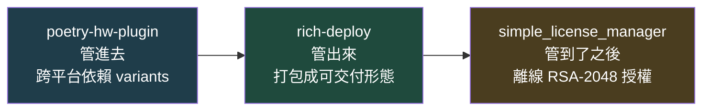

<h1 align="center">林常瀚 Hank Lin</h1>

  <b>工業 AI 視覺工程師</b>｜自動控制背景　·　台中

---

把 AI 檢測裝進既有產線，並讓它長期跑得穩。從取像、選型、推論加速到服務化與現場維運，每一層都親手做過；三個產業實際上線。

**現況**　自動化系統整合商 · 工程師（AI 視覺與產線導入）｜2024.03 – 2026.06｜逢甲大學 自動控制工程 學士｜方向：視覺演算法 · AI 應用 · 自動化整合

自動控制本科，在自動化系統整合商擔任工程師（2024.03–2026.06）。做的是把 AI 檢測裝進既有產線的完整流程：相機與光源選型、影像擷取策略、特徵分析與模型選型、推論加速、服務化常駐與現場維運。設備端自己接 —— 相機觸發、光源、PLC 交握。

做事方式：

- **先比較、再選擇。** 模型不憑印象挑：同一批現場資料跑過六種異常偵測模型，看數字決定；3D 案先試了深度學習，發現傳統幾何方法就夠準，就用簡單的那個。→ [瑕疵檢測](#做過什麼)、[3D 定位](#做過什麼)
- **重複的事做成工具。** 三條產線的檢測案共用一套訓練後端，標註、訓練到部署接成一條線 —— 新案子不必從零開始，每一版模型也查得到是用哪批資料訓練的。→ [瑕疵檢測](#做過什麼)、[標註平台](#做過什麼)
- **從寫功能到負責整個產品。** 最後一年主導 VisionFlow：架構、授權保護、部署流程、商用模型的授權合規都自己定，第一次為「能不能賣」負責。→ [VisionFlow](#做過什麼)

> 曾追一個只在現場那台機器上發生的 crash。抓 dump 比對，三份 failure hash 完全相同 —— 硬體不會每次死在同一個位址。翻 OpenVINO 原始碼找到文件沒寫的預設值開了 64 條閒置執行緒在跟 asyncio 搶 GIL。**症狀像硬體，根因在 library。**
> 所以系統要穩，硬體、驅動、軟體版本、library 參數、組合測試，每一層都得親手顧過 —— 模型只是其中一層。

## 做過什麼

| 專案 | 重點成果 |
|---|---|
| **工業表面瑕疵檢測系統** | 跨三個產業實際上線，換產業**只換模型、不動架構**；AI 找候選、傳統 AOI 判真假；現場推論 4×512² 約 **0.25 秒** |
| **3D 點雲定位與機械手臂取放** | **視覺端**：投射紋理立體視覺 + Open3D，現場實測誤差 **< 1 cm**；手眼座標轉換自行實作，換場地**現場就能重校** |
| **VisionFlow — SOP 工序電子化與即時監控** | SOP 每一步**自動判定、可追溯**，18 項客戶需求全數落地；授權綁機器指紋、非對稱簽章驗證，自製 Poetry plugin 做部署 |
| **CV 多任務標註暨訓練平台** | 物件偵測、實例分割、瑕疵檢測**三種任務一個平台**，標註到訓練驗證一站式；SAM2 半自動標註，逐點描邊變成點一下；**Docker Compose 五服務架構**，離線映像包一鍵安裝、模型服務可自選 |

## 交付鏈上的三個 Poetry plugin

單獨看每一個都只是小工具，合起來是一條完整的交付鏈 ——
被實際交付產品逼出來的，不是設計出來的。

## 開源

| 專案 | 做什麼 |
|---|---|
| [simple_license_manager](https://github.com/HANK572718/simple_license_manager) | `licmg` — 離線 RSA-2048 授權管理，Poetry plugin + 獨立 CLI |
| [rich-deploy](https://github.com/HANK572718/rich-deploy) | 部署打包用的 Poetry plugin |
| [poetry-hw-plugin](https://github.com/HANK572718/poetry-hw-plugin) | 跨平台依賴管理，自動切換硬體 variants |
| [torch-xpu-patch](https://github.com/HANK572718/torch-xpu-patch) | Intel XPU（Arc GPU）通用 Torch monkey patch |
| [craft_file_mcp](https://github.com/HANK572718/craft_file_mcp) | Craft 檔案存取的 MCP server |
| [img2voice](https://github.com/HANK572718/img2voice) | 書頁照片轉文字與語音，本機 GPU（GOT-OCR2.0 + edge-tts） |
| [FCU_LabVIEW_Course_AI_part](https://github.com/HANK572718/FCU_LabVIEW_Course_AI_part) | 逢甲大學 LabVIEW + Python 課程 AI 段教材 |
| [nvchad_config](https://github.com/HANK572718/nvchad_config) | 個人 Neovim / NvChad 設定 |

## 技術棧

**CV**　OpenCV · anomalib（RD / EfficientAD / FastFlow / STFPM / PatchCore / PaDiM）· YOLOv10 / v11-seg · RF-DETR · Detectron2 · SAM / SAM2
**推論部署**　OpenVINO · TensorRT · ONNX · cx_Freeze · NSSM · Poetry
**3D 視覺**　Open3D · PCL · DBSCAN · RANSAC · 立體相機 SDK · 座標系校正
**後端 / MLOps**　Python · FastAPI · 非同步推論 · MLflow · TensorBoard
**LLM**　LangChain · LangGraph · SQL Agent · RAG · Streamlit
**硬體整合**　工業相機 · 雷射位移感測 · NVIDIA GPU / Jetson Nano · Intel Arc GPU / Core Ultra NPU · 工業電腦 · PLC · PoE

## 學歷

逢甲大學　自動控制工程學系　學士　｜　國立台中高工　機械科

**教學**　逢甲大學 LabVIEW + Python 課程 AI 段設計與授課（[教材公開](https://github.com/HANK572718/FCU_LabVIEW_Course_AI_part)）；AI Summer Camp CV & LLM 組 mentor，設計三層養成路徑；逢甲大學通識課「系統思維學統計」助教，帶 Excel／Minitab／FlexSim 實作。

團隊畢業專題「新式自動化垂直農場」獲**國科會大專生研究計畫**與學術論壇**最佳論文獎**，負責軟體：MCU 控制與影像辨識；
全國技能競賽機器人職種**中部分區賽第四**（48 隊）。

---

  <a href="https://HANK572718.github.io/">個人網站</a>　·　<a href="mailto:ha28763024@gmail.com">ha28763024@gmail.com</a>

